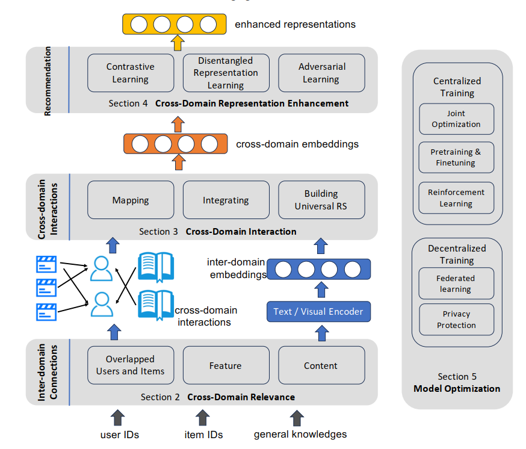
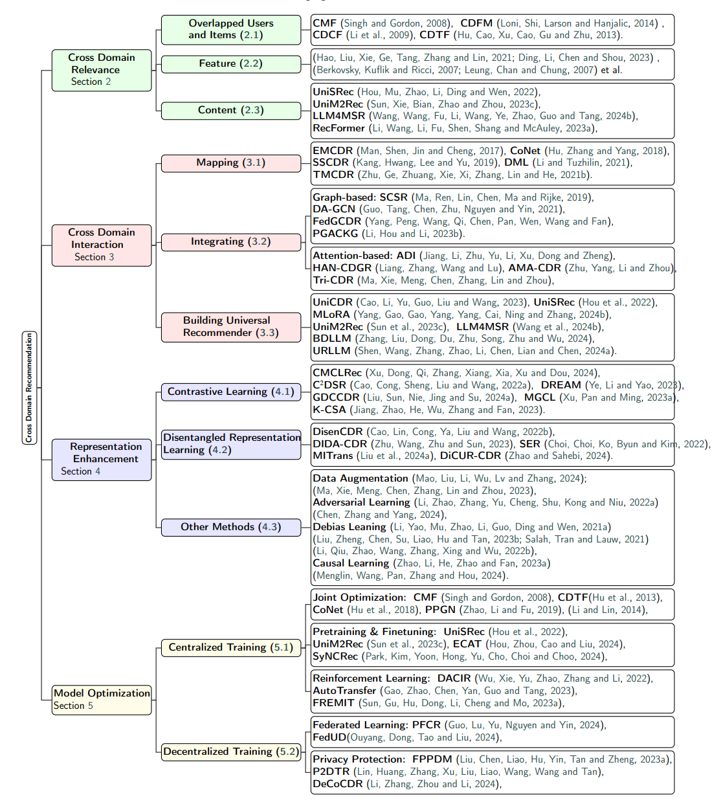

<div align="center">
  <!-- <h1><b> Time-LLM </b></h1> -->
  <!-- <h2><b> Time-LLM </b></h2> -->
  <h2><b> A Survey on  Cross-Domain Recommendation</b></h2>
</div>


<div align="center">
**[<a href="https://arxiv.org/abs/2503.10677">Online Paper Download Link</a>]**
</div>

---

> 🙋 Please let us know if you find out a mistake or have any suggestions!
>
> 🌟 If you find this resource helpful, please consider to star this repository and cite our research:

```bibtex
@article{zhang2025comprehensive,
  title={A Comprehensive Survey on Cross-Domain Recommendation: Taxonomy, Progress, and Prospects},
  author={Zhang, Hao and Cheng, Mingyue and Liu, Qi and Jiang, Junzhe and Wang, Xianquan and Zhang, Rujiao and Lei, Chenyi and Chen, Enhong},
  journal={arXiv preprint arXiv:2503.14110},
  year={2025}
}
```

## Introduction

This repository is dedicated to collecting and categorizing papers on  Cross-Domain Recommendation (CDR) based on our survey paper: _A Comprehensive Survey on Cross-Domain Recommendation: Taxonomy, Progress, and Prospects_. Given the rapid advancements in this field, we will continue to update both the paper and this repository.

<p align="center">

</p>

CDR consists of four main components: (1) Cross-Domain Relevance (2) Cross-Domain Interaction (3) Cross-Domain Representation Enhancement (4) Model Optimization.


### 
<p align="center">

</p>

### Cross Domain Relevance


1. **Overlapped Users & Items**

   • [Relational learning via collective matrix factorization](https://dl.acm.org/doi/abs/10.1145/1401890.1401969)

   • [Cross-domain collaborative filtering with factorization machines](https://link.springer.com/chapter/10.1007/978-3-319-06028-6_72)

   • [Can movies and books collaborate? cross-domain collaborative filtering for sparsity reduction](https://www.ijcai.org/Proceedings/09/Papers/338.pdf)

2. **Feature**

   • [Adversarial feature translation for multi-domain recommendation](https://dl.acm.org/doi/abs/10.1145/3447548.3467176)

   • [Tpuf: Enhancing cross-domain sequential recommendation via transferring pre-trained user features](https://dl.acm.org/doi/abs/10.1145/3583780.3615094)


3. **Content** 

   • [Towards universal sequence representation learning for recommender systems](https://dl.acm.org/doi/abs/10.1145/3534678.3539381)

   • [Universal Multi-modal Multi-domain Pre-trained Recommendation](https://arxiv.org/abs/2311.01831)

   • [Llm4msr: An llm-enhanced paradigm for multi-scenario recommendation](https://dl.acm.org/doi/abs/10.1145/3627673.3679743)

### Cross Domain Interaction


1. **Mapping**

   • [Cross-domain recommendation: An embedding and mapping approach](https://static.aminer.cn/upload/pdf/program/59ae3c262bbe271c4c71f007_0.pdf)

   • [Conet: Collaborative cross networks for cross-domain recommendation](https://dl.acm.org/doi/abs/10.1145/3269206.3271684)

   • [Semi-supervised learning for cross-domain recommendation to cold-start users](https://dl.acm.org/doi/abs/10.1145/3357384.3357914)

   • [Dual metric learning for effective and efficient cross-domain recommendations](https://ieeexplore.ieee.org/abstract/document/9409658/)

   • [Transfer-meta framework for cross-domain recommendation to cold-start users](https://dl.acm.org/doi/abs/10.1145/3404835.3463010)

2. **Integrating**

   a. **Graph-Based**

   • [π-net: A parallel information-sharing network for shared-account cross-domain sequential recommendations](https://dl.acm.org/doi/abs/10.1145/3331184.3331200)

   • [DA-GCN: A domain-aware attentive graph convolution network for shared-account cross-domain sequential recommendation](https://arxiv.org/abs/2105.03300)

   • [Federated graph learning for cross-domain recommendation](https://arxiv.org/abs/2410.08249)

   • [Preference-aware graph attention networks for cross-domain recommendations with collaborative knowledge graph](https://dl.acm.org/doi/abs/10.1145/3576921)

   b. **Attention-Based**

   • [Adaptive domain interest network for multi-domain recommendation](https://dl.acm.org/doi/abs/10.1145/3511808.3557137)

   • [A hierarchical attention network for cross-domain group recommendation](https://ieeexplore.ieee.org/abstract/document/9874775/)

   • [An Active Masked Attention Framework for Many-to-Many Cross-Domain Recommendations](https://dl.acm.org/doi/abs/10.1145/3664647.3681435)

   • [Triple sequence learning for cross-domain recommendation](https://dl.acm.org/doi/abs/10.1145/3638351)


3. **Building Universal Recommender** 

   • [Towards universal sequence representation learning for recommender systems](https://dl.acm.org/doi/abs/10.1145/3534678.3539381)

   • [Universal Multi-modal Multi-domain Pre-trained Recommendation](https://arxiv.org/abs/2311.01831)

   • [Llm4msr: An llm-enhanced paradigm for multi-scenario recommendation](https://dl.acm.org/doi/abs/10.1145/3627673.3679743)

   • [Towards universal cross-domain recommendation](https://dl.acm.org/doi/abs/10.1145/3539597.3570366)

   • [Mlora: Multi-domain low-rank adaptive network for ctr prediction](https://dl.acm.org/doi/abs/10.1145/3640457.3688134)

   • [Bridging the information gap between domain-specific model and general llm for personalized recommendation](https://link.springer.com/chapter/10.1007/978-981-97-7232-2_19)

   • [Exploring user retrieval integration towards large language models for cross-domain sequential recommendation](https://arxiv.org/abs/2406.03085)

### Cross Domain Representation Enhancement


1. **Contrastive Learning**

   • [Cmclrec: Cross-modal contrastive learning for user cold-start sequential recommendation](https://dl.acm.org/doi/abs/10.1145/3626772.3657839)

   • [Contrastive cross-domain sequential recommendation](https://dl.acm.org/doi/abs/10.1145/3511808.3557262)

   • [Dream: Decoupled representation via extraction attention module and supervised contrastive learning for cross-domain sequential recommender](https://dl.acm.org/doi/abs/10.1145/3604915.3608780)

   • [Graph disentangled contrastive learning with personalized transfer for cross-domain recommendation](https://ojs.aaai.org/index.php/AAAI/article/view/28723)

   • [A multi-view graph contrastive learning framework for cross-domain sequential recommendation](https://dl.acm.org/doi/abs/10.1145/3604915.3608785)

   • [Knowledge-aware cross-semantic alignment for domain-level zero-shot recommendation](https://dl.acm.org/doi/abs/10.1145/3583780.3614945)

2. **Disentangled Representation Learning**

   • [Disencdr: Learning disentangled representations for cross-domain recommendation](https://dl.acm.org/doi/abs/10.1145/3477495.3531967)

   • [Domain disentanglement with interpolative data augmentation for dual-target cross-domain recommendation](https://dl.acm.org/doi/abs/10.1145/3604915.3608802)

   • [Based domain disentanglement without duplicate users or contexts for cross-domain recommendation](https://dl.acm.org/doi/abs/10.1145/3511808.3557434)

   • [Mutual information-based preference disentangling and transferring for non-overlapped multi-target cross-domain recommendations](https://dl.acm.org/doi/abs/10.1145/3626772.3657780)

   • [Discerning Canonical User Representation for Cross-Domain Recommendation](https://dl.acm.org/doi/abs/10.1145/3640457.3688114)


3. **Data Augmentation** 

   • [Cross-reconstructed augmentation for dual-target cross-domain recommendation](https://dl.acm.org/doi/abs/10.1145/3626772.3657902)

   • [Exploring false hard negative sample in cross-domain recommendation](https://dl.acm.org/doi/abs/10.1145/3604915.3608791)

4. **Adversarial Learning** 

​		• [RecGURU: Adversarial learning of generalized user representations for cross-domain recommendation](https://dl.acm.org/doi/abs/10.1145/3488560.3498388)

​		• [Improving Adversarial Robustness for Recommendation Model via Cross-Domain Distributional Adversarial Training](https://dl.acm.org/doi/abs/10.1145/3640457.3688116)

5. **Debias Learning** 

​		• [Debiasing learning based cross-domain recommendation](https://dl.acm.org/doi/abs/10.1145/3447548.3467067)

​		• [Joint internal multi-interest exploration and external domain alignment for cross domain sequential recommendation](https://dl.acm.org/doi/abs/10.1145/3543507.3583366)

​		• [Towards source-aligned variational models for cross-domain recommendation](https://dl.acm.org/doi/abs/10.1145/3460231.3474265)

​		• [Gromov-wasserstein guided representation learning for cross-domain recommendation](https://dl.acm.org/doi/abs/10.1145/3511808.3557338)

​		• [Improving Adversarial Robustness for Recommendation Model via Cross-Domain Distributional Adversarial Training](https://dl.acm.org/doi/abs/10.1145/3640457.3688116)	

6. **Causal Learning**

​		• [Sequential recommendation via an adaptive cross-domain knowledge decomposition](https://dl.acm.org/doi/abs/10.1145/3583780.3615058)

​		• [C²DR: Robust Cross-Domain Recommendation based on Causal Disentanglement](https://dl.acm.org/doi/abs/10.1145/3616855.3635809)


### Model Optimization


1. **Centralized Training**

   a.  **Joint Optimization**

   • [Relational learning via collective matrix factorization](https://dl.acm.org/doi/abs/10.1145/1401890.1401969)

   • [Conet: Collaborative cross networks for cross-domain recommendation](https://dl.acm.org/doi/abs/10.1145/3269206.3271684)

   b. **Pretraining & Finetuning**

   • [Towards universal sequence representation learning for recommender systems](https://dl.acm.org/doi/abs/10.1145/3534678.3539381)

   • [Universal Multi-modal Multi-domain Pre-trained Recommendation](https://arxiv.org/abs/2311.01831)

   • [ECAT: A Entire space Continual and Adaptive Transfer Learning Framework for Cross-Domain Recommendation](https://dl.acm.org/doi/abs/10.1145/3626772.3661348)

   • [Pacer and Runner: Cooperative Learning Framework between Single-and Cross-Domain Sequential Recommendation](https://dl.acm.org/doi/abs/10.1145/3626772.3657710)

   c. **Reinforcement Learning**

   • [Dynamics-aware adaptation for reinforcement learning based cross-domain interactive recommendation](https://dl.acm.org/doi/abs/10.1145/3477495.3531969)

   • [AutoTransfer: Instance transfer for cross-domain recommendations](https://dl.acm.org/doi/abs/10.1145/3539618.3591701)

   • [REMIT: reinforced multi-interest transfer for cross-domain recommendation](https://ojs.aaai.org/index.php/AAAI/article/view/26181)

2. **Decentralized Training**

   a. **Federated Learning**

   • [Prompt-enhanced federated content representation learning for cross-domain recommendation](https://dl.acm.org/doi/abs/10.1145/3589334.3645337)

   • [FedUD: exploiting unaligned data for cross-platform federated click-through rate prediction](https://dl.acm.org/doi/abs/10.1145/3626772.3657941)

   b. **Privacy Protection**

   • [Federated Probabilistic Preference Distribution Modelling with Compactness Co-Clustering for Privacy-Preserving Multi-Domain Recommendation](https://www.ijcai.org/proceedings/2023/0245.pdf)


​	   • [Graph disentangled contrastive learning with personalized transfer for cross-domain recommendation](https://ojs.aaai.org/index.php/AAAI/article/view/28723)

​       • [DeCoCDR: Deployable Cloud-Device Collaboration for Cross-Domain Recommendation](https://dl.acm.org/doi/abs/10.1145/3626772.3657786)

## Contact
If you have any questions or suggestions, feel free to contact our team:

Current:

- Hao Zhang (zh2001@mail.ustc.edu.cn)

- Mingyue Cheng (mycheng@ustc.edu.cn)

  

  
